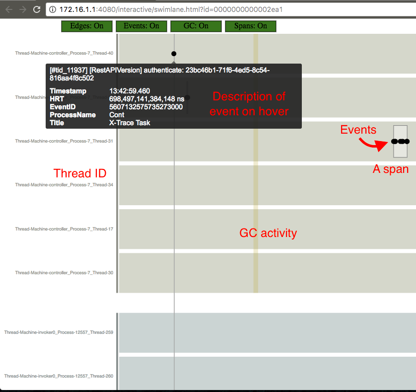

# End-to-end Tracing for Serverless Applications

## Code
See the [instrumentation branch at my fork of OpenWhisk](https://github.com/k4rtik/incubator-openwhisk/tree/instrumentation)

## Screenshots
See screenshots generated for [invoking a simple javascript hello action](https://github.com/apache/incubator-openwhisk/blob/master/docs/actions.md#creating-and-invoking-a-simple-javascript-action) in this [Google Photos Album](https://goo.gl/photos/va86jL1G6vocDAc38) (Tip: slide through the album to see the excecution flow across the Controller and the Invoker from left to right).

### Description and legend for the screenshots
Consider the following part of the screenshot:

- The first 6 threads (horizontal bars) belong to the Controller process
- The rest 5 threads (only two visible in the partial screenshot above) belong to the Invoker process
- A span represents a method call in a thread and can consist of many events logged by X-Trace
- ID of 2ea1 in the URL corresponds to the OpenWhisk transaction ID `#tid_11937` in the hovertext shown above for the authentication related log event recorded by the Controller process' thread 1 (`controller_Process-7_Thread-40`)
